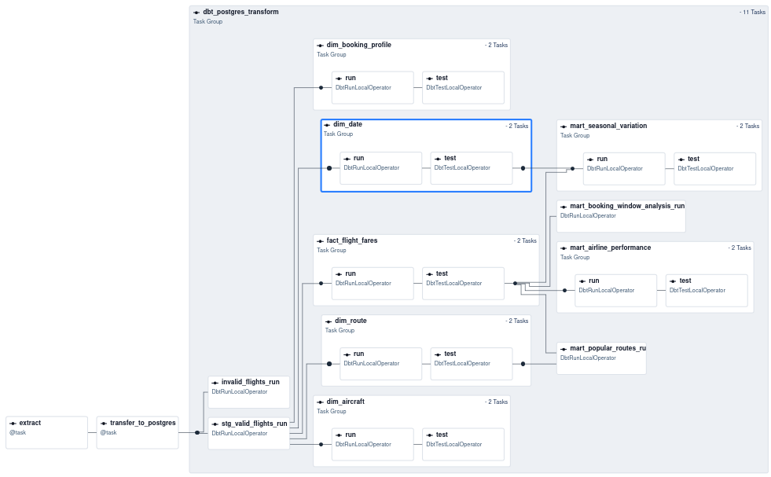
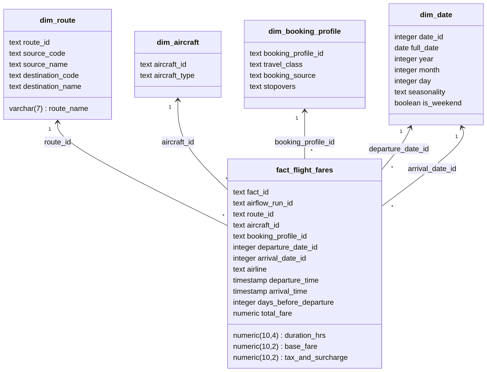
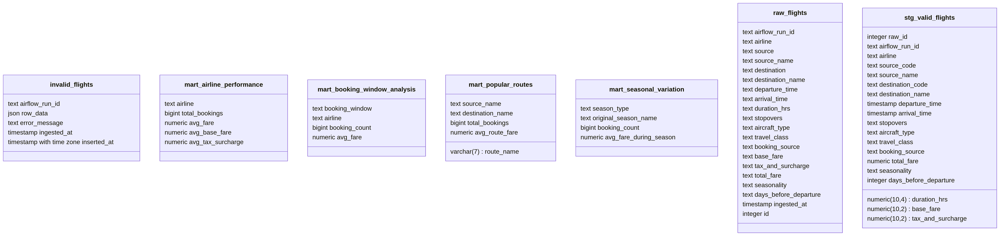

# Project Report: Flight Price Analysis Pipeline
---

## 1. Pipeline Architecture and Execution Flow

The project utilizes a modern, multi-tier **ELT (Extract, Load, Transform)** architecture designed for maximum memory efficiency, idempotency, and scalability. It simulates an enterprise environment where data moves from an operational database to an analytical Data Warehouse.

**Architectural Layers:**
*   **External Source:** Flight Price Dataset (Bangladesh) accessed dynamically via the `kagglehub` API.
*   **Operational Database (MySQL):** Acts as the raw landing zone simulating an external OLTP system.
*   **Data Warehouse (PostgreSQL):** The central analytical engine where data modeling and reporting occur.
*   **Transformation Engine (dbt):** Executes SQL-based transformations natively inside PostgreSQL.
*   **Orchestrator (Apache Airflow):** Schedules, links, and monitors the Python scripts and dbt models.

**Execution Flow:**
1.  **Extract:** Python downloads the CSV and bulk-inserts it into MySQL using native `LOAD DATA LOCAL INFILE`.
2.  **Transfer:** Python extracts the data from MySQL and streams it into the PostgreSQL staging schema using memory buffers and the Postgres `COPY` command.
3.  **Transform (Bronze to Silver):** dbt cleans the data, routes bad records to a Dead Letter Queue (DLQ), and models the valid data into a Kimball Star Schema.
4.  **Analyze (Silver to Gold):** dbt generates materialized KPI tables ready for immediate BI dashboard consumption.

---

## 2. Description of Each Airflow DAG / Task

The pipeline is governed by a single daily DAG: `flight_price_elt_pipeline`.

### Task 1: `extract` (PythonOperator)
*   **Description:** Connects to the Kaggle API, downloads the latest dataset, and loads it into the MySQL `raw_flights` table.
*   **Technical Detail:** Completely bypasses Pandas to avoid Out-Of-Memory (OOM) errors. It uses MySQL’s `LOAD DATA INFILE` command. It assigns the Airflow `run_id` to every row to guarantee **data lineage**.

### Task 2: `transfer_to_postgres` (PythonOperator)
*   **Description:** Migrates the raw data from the MySQL operational database to the PostgreSQL Data Warehouse.
*   **Technical Detail:** Uses `tempfile.TemporaryFile` to stream data in chunks of 50,000 rows. This writes to disk temporarily rather than overloading worker RAM, securely passing the data to Postgres via the `COPY FROM STDIN` command. 

### Task Group 3: `dbt_postgres_transform` (Cosmos DbtTaskGroup)
Astronomer Cosmos dynamically parses the dbt project and converts the SQL models into a dependency graph of Airflow tasks:
*   **Staging & DLQ:** Runs `stg_valid_flights` to cast data types and sanitize strings. Concurrently runs `invalid_flights` to capture rejected rows.
*   **Dimensions (Silver):** Generates `dim_route`, `dim_aircraft`, `dim_booking_profile`, and `dim_date` in parallel. Uses `dbt_utils.generate_surrogate_key` to create MD5 hashed IDs.
*   **Fact (Silver):** Runs `fact_flight_fares` to join the staging data with surrogate keys, representing the core transactional grain.
*   **KPIs (Gold):** Executes the aggregation models to produce final reporting tables.
*   **Testing:** Executes data quality tests defined in `schema.yml` (Referential integrity, non-nullability).

#### DB Schema

---

## 3. KPI Definitions and Computation Logic

The Gold layer contains materialized tables designed to answer core business questions instantly.

### KPI 1: Average Fare & Booking Count by Airline
*   **Definition:** Measures market share (volume) and pricing strategy (budget vs. premium) per airline.
*   **Computation Logic:** Groups the `fact_flight_fares` table by `airline`. Computes the `COUNT` of `fact_id` (Bookings) and the `AVG` of `total_fare`, rounded to two decimal places.

### KPI 2: Seasonal Fare Variation
*   **Definition:** Evaluates how flight prices fluctuate between peak and off-peak travel periods. 
*   **Computation Logic:** Uses a hybrid approach combining source-provided labels and date-driven overrides.
    *   *Peak:* Dates explicitly labeled as "Eid", "Hajj", or "Winter Holidays", OR dates falling in known holiday windows (e.g., Dec 15 - Jan 15, mid-April).
    *   *Off-Peak:* All other dates.
    *   *Calculation:* Groups by the calculated `season_type` to compare the average `total_fare` and calculates the price premium (difference) between the two.

### KPI 3: Most Popular Routes (O&D Market Analysis)
*   **Definition:** Identifies the highest-traffic Origin & Destination corridors.
*   **Computation Logic:** Joins `fact_flight_fares` with `dim_route`. Groups by `route_name` (e.g., "DAC-LHR") to count total bookings, sorting descending and limited to the Top 20 routes.

---

## 4. Challenges Encountered and Resolutions

### Challenge 1: Memory Exhaustion (OOM) via Pandas
*   **Issue:** Initial iterations used the `pandas` library to read CSVs and transfer data between databases. As data size grew, Pandas consumed too much RAM, causing the Airflow worker containers to crash.
*   **Resolution:** Completely removed Pandas from the architecture. Refactored the extraction task to use native `LOAD DATA` and the transfer task to use Python's `tempfile` module coupled with `psycopg2.copy_expert`. This allowed infinite scalability with a flat memory footprint.

### Challenge 2: "Dependency Hell" and Environment Interruptions
*   **Issue:** Airflow has a massive and incredibly strict Python dependency tree. Attempting to install third-party packages—specifically `dbt-mysql` alongside other data processing libraries—caused severe "dependency hell." The MySQL packages interrupted Airflow’s core dependencies, resulting in package version conflicts that completely broke the Airflow environment and prevented the scheduler from booting.
*   **Resolution:** Solved this through two distinct engineering decisions:
    1.  **Architectural Pivot:** Eliminated the problematic `dbt-mysql` package entirely. MySQL was retained purely as a raw ingestion endpoint, while the heavy lifting was shifted to PostgreSQL using the officially supported, highly stable `dbt-postgres` adapter.
    2.  **Environment Isolation:** Stripped the `requirements.txt` down to the bare minimum (`mysql-connector-python`, `kagglehub`, and a few). By isolating transformations to dbt and keeping the Airflow Python environment clean, the orchestrator remained 100% stable. 

### Challenge 3: Maintaining Idempotency with Surrogate Keys
*   **Issue:** Using traditional Database `AUTO_INCREMENT` IDs for primary keys meant that rerunning a failed Airflow DAG would result in different IDs and duplicate rows in the Fact table. Furthermore, manually hashing columns using `MD5(a || b)` resulted in null hashes if any single column contained a null value.
*   **Resolution:** Adopted `dbt_utils.generate_surrogate_key()`. This macro automatically wraps columns in `COALESCE` statements before hashing, guaranteeing deterministic, non-null surrogate keys. Combined with `TRUNCATE` logic during the load phase, the pipeline is now 100% idempotent.
